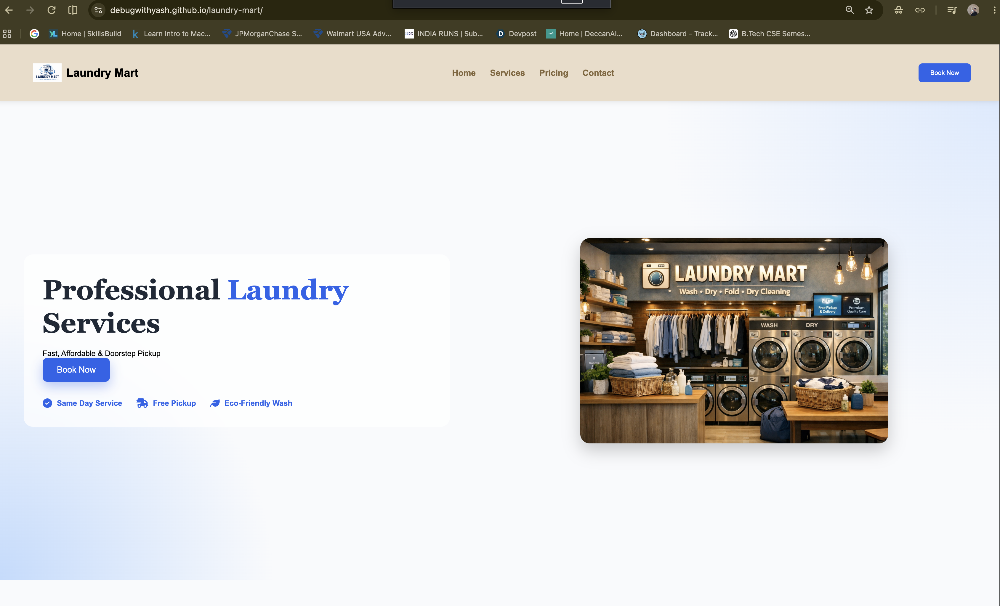

# 🧺 Laundry Mart

A modern and responsive laundry service landing page built using **HTML5** and **CSS3**. The website features a clean UI, responsive layout, service cards, pricing table, booking form, and a professional footer.

## 🚀 Live Demo

https://debugwithyash.github.io/laundry-mart/

## 📸 Preview



## ✨ Features

- Responsive Navigation Bar
- Modern Hero Section
- Service Cards with Hover Effects
- Pricing Table
- Booking Form
- Professional Footer
- Smooth Scrolling
- CSS Flexbox & Grid
- Media Queries for Responsive Design
- Font Awesome Icons

## 🛠️ Technologies Used

- HTML5
- CSS3
- Flexbox
- CSS Grid
- Media Queries
- Font Awesome

## 📂 Project Structure

```
laundry-mart/
│
├── images/
├── index.html
├── style.css
└── README.md
```

## 📚 What I Learned

- Creating responsive layouts with Flexbox and Grid
- Building reusable UI components
- Styling forms and tables
- Using Media Queries for mobile responsiveness
- Creating modern landing pages with pure HTML & CSS

## 👨‍💻 Author

**Yash Chaudhary**

- GitHub: https://github.com/debugwithyash
- LinkedIn: https://www.linkedin.com/in/yash-chaudhary-325814329/

---

⭐ If you like this project, consider giving it a star!
